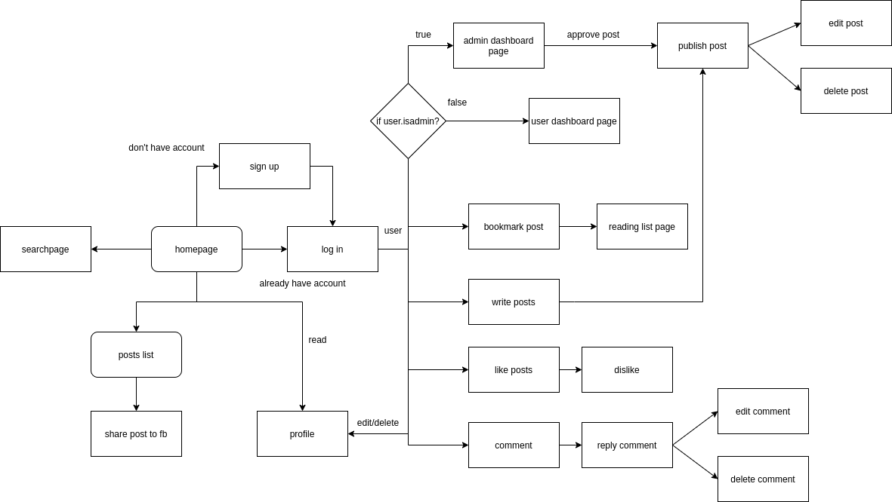

# **Dev-to clone**

This is my project to learn how to build a app using Ruby on Rails framework. Watch demo [here](http://137.184.91.249/)

# **Database Diagram**

[](https://mermaid.live/edit#pako:eNqFU11vgjAU_SvNfRYDKhj7ZhzzRceiLssWEtNBVTKgpJSoA_77ypeiuOw-3dxz7jm3t20KDnMpYKD8ySN7TgI7RDLe1uYKZZmisBS9WusNwuhA4i62MqezAuSUOKILz6zl0nwpCA4LAhrWlFKxQ7kYtOHG4AI2_L_wZ2uxsN5RzhQly6phMNox32fHlnoBy-7NdH6jPd2Yc2v10YjfwaVYWuVFxIJ74R6FJKCdIg2I53eqEYnjI-PuFfBCQfeUI878WiRvjdk1E57wW26CnoTcrRRpdltxiUjiRvuBWXFb8dZhSdNVm1bb7LqWDeTLp1txjm7nvOwsvZvqupb89ua68g8OUNfLR3Nn_M9JoAcB5XL9rnzWpZcN4kDlMIBl6hL-bYMdFjySCLY-hw5gwRPagyRyiaD1RwC8I34sqxEJAadwAjwc6v3JQFPHhqFpw7Gq9-AMWNFGfbWIwcSY6MZIV_W8Bz-MSQmtbP8s81qOup5gfFl9u_L35b8qXgyZ)

# **Dev-to flowchart**



# **Setup on Ubuntu 20.04**

## **1. Installing Ruby using rbenv**

> This project use ruby 2.7.0, you can install a higher version.

### 1. Add dependencies

```
# Adding Node.js repository
$ curl -sL https://deb.nodesource.com/setup_lts.x | sudo -E bash -

# Adding Yarn repository
$ curl -sS https://dl.yarnpkg.com/debian/pubkey.gpg | sudo apt-key add -
$ echo "deb https://dl.yarnpkg.com/debian/ stable main" | sudo tee /etc/apt/sources.list.d/yarn.list
$ sudo add-apt-repository ppa:chris-lea/redis-server

# Refresh our packages list with the new repositories
$ sudo apt-get update

# Install our dependencies for compiiling Ruby along with Node.js and Yarn
$ sudo apt-get install git-core curl zlib1g-dev build-essential libssl-dev libreadline-dev libyaml-dev libsqlite3-dev sqlite3 libxml2-dev libxslt1-dev libcurl4-openssl-dev software-properties-common libffi-dev dirmngr gnupg apt-transport-https ca-certificates redis-server redis-tools nodejs yarn

```

### 2. Installing Ruby

```
$ git clone https://github.com/rbenv/rbenv.git ~/.rbenv
$ echo 'export PATH="$HOME/.rbenv/bin:$PATH"' >> ~/.bashrc
$ echo 'eval "$(rbenv init -)"' >> ~/.bashrc
$ git clone https://github.com/rbenv/ruby-build.git ~/.rbenv/plugins/ruby-build
$ echo 'export PATH="$HOME/.rbenv/plugins/ruby-build/bin:$PATH"' >> ~/.bashrc
$ git clone https://github.com/rbenv/rbenv-vars.git ~/.rbenv/plugins/rbenv-vars
$ exec $SHELL
$ rbenv install 2.7.0
$ rbenv global 2.7.0
$ ruby -v
$ # ruby 2.7.0
```

## **2. Create database use postgresql**

```
# Installing postgres
$ sudo apt-get install postgresql postgresql-contrib libpq-dev

# Log in to postgres with root user
$ sudo su - postgres

# Create user in potgres
$ createuser --pwprompt {yourusername}

# Create database
$ createdb -O {yourusername} dev-to
```

## **3. Setup dev-to**

### 1. Clone this repository to machine

```
git clone https://github.com/Kaito-Kido/dev-to.git
```

### 2. Installing necessary gem

- If you haven't installed `bundler` yet:

```
gem install bundler
```

- Installing gem in Gemfile:

```
$ cd dev-to
$ bundle install # or bundle
```

- Migrating database:

```
rails db:migrate
```

- If you want to create fake data, run:

```
rails db:seed
```

# **4. Local hosting**

Open a terminal and run:

```
rails s
```

Open another terminal to run webpack for javascript compling;

```
bin/webpack-dev-server
```

Your **dev-to** app will be on [localhost](http://localhost:3000/home/index)
